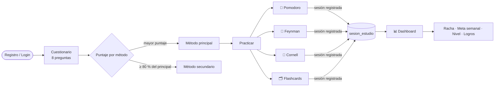

<div align="center">

# 🐝 FocusHive

### Descubre tu método de estudio ideal y mide tu progreso

*Un diagnóstico de 8 preguntas te dice cómo aprendes mejor. Después, practicas ese método dentro de la app y cada sesión cuenta.*

<br/>

[](https://www.python.org/)
[](https://fastapi.tiangolo.com/)
[](https://neon.tech/)
[](https://react.dev/)
[](https://vite.dev/)
[](https://tailwindcss.com/)

[](backend/tests)
[](frontend/src)
[](DEPLOY.md)
[](#-licencia)

<br/>

**[🚀 Demo](#-demo) · [✨ Funcionalidades](#-funcionalidades) · [🧠 Cómo funciona](#-cómo-funciona-por-dentro) · [⚡ Inicio rápido](#-inicio-rápido) · [🔌 API](#-api) · [☁️ Despliegue](#️-despliegue)**

</div>

---

## 🎯 ¿Qué problema resuelve?

La mayoría de estudiantes usa siempre la misma técnica, sin saber si es la que mejor encaja con su forma de aprender. FocusHive lo resuelve en tres pasos:

1. **Diagnostica**: un cuestionario corto puntúa cuatro métodos de estudio y recomienda el más compatible contigo.
2. **Practica**: cada método tiene su propia herramienta dentro de la app, no solo una explicación.
3. **Mide**: cada sesión alimenta un dashboard con racha, horas semanales, meta, nivel y logros.

> Nació como proyecto universitario en equipo y fue modernizado en 2026 para funcionar de punta a punta, con tests y despliegue en la nube. Este README documenta la versión actual.

---

## 🚀 Demo

| | URL |
|---|---|
| 🌐 Aplicación | *pendiente de publicar (sigue [DEPLOY.md](DEPLOY.md))* |
| 📘 API interactiva (Swagger) | `https://<tu-api>.onrender.com/docs` |
| 💚 Salud del servicio | `https://<tu-api>.onrender.com/health` |

<!-- Cuando tengas capturas, guárdalas en docs/screenshots/ y descomenta:
<p align="center">
  
  
</p>
-->

---

## ✨ Funcionalidades

<table>
<tr>
<td width="50%" valign="top">

### 🧭 Diagnóstico inteligente
8 preguntas, 4 opciones cada una. Cada opción suma puntos a un método. Si el segundo método queda a menos del 20 % del primero, también se recomienda como alternativa.

### 🍅 Pomodoro
Temporizador de 25/5/15 minutos con contador de ciclos. Al finalizar, la sesión se guarda con su duración real.

### 🧠 Técnica Feynman
Flujo guiado en 4 pasos (tema, explicación, vacíos, versión final) con **autoguardado cada 30 segundos** y recuperación del trabajo en curso.

### 📝 Notas Cornell
Editor de tres secciones (notas, pistas, resumen), listado de notas y edición posterior.

</td>
<td width="50%" valign="top">

### 🗂️ Flashcards
Colecciones por curso con color, tarjetas pregunta/respuesta y modo repaso que clasifica cada tarjeta en fácil, media o difícil.

### 📊 Dashboard de progreso
Minutos de hoy y de la semana, desglose diario, **racha de días consecutivos**, método recomendado vs. más usado, meta semanal configurable y **6 logros** desbloqueables.

### 📅 Calendario semanal
Bloques de estudio por día y hora, con método y materia, guardados en la base de datos.

### 🔐 Cuenta y seguridad
Registro y login por usuario o correo, JWT con expiración, contraseñas con bcrypt, cada recurso filtrado por su dueño y borrado de cuenta en cascada.

</td>
</tr>
</table>

---

## 🧠 Cómo funciona por dentro



### El algoritmo del diagnóstico

Cada opción del cuestionario apunta a un método y vale entre 2 y 3 puntos (las preguntas sobre dificultades pesan más). El backend suma los puntos por método en **una sola consulta**, ordena y aplica una regla simple: el segundo método solo se muestra si alcanza el **80 %** del puntaje del primero. Las respuestas quedan guardadas, así que el resultado se puede reconstruir en cualquier momento sin recalcular a ciegas.

### Progreso, nivel y logros

| Métrica | Cómo se calcula |
|---|---|
| **Racha** | Días consecutivos con al menos una sesión; sigue viva si estudiaste hoy o ayer |
| **Nivel** | Sube uno cada **10 horas** acumuladas de estudio |
| **Meta semanal** | 10 h por defecto, editable; el dashboard muestra el porcentaje alcanzado |
| **Logros** | 🎯 Primera sesión · ⭐ Meta semanal · 🔥 3 días seguidos · 💪 20 horas · 🧩 Los 4 métodos · 👑 Semana perfecta |

Los logros se evalúan al registrar cada sesión y la respuesta incluye los recién desbloqueados, para que el frontend los celebre al instante.

### Decisiones técnicas que vale la pena conocer

- **Un solo sistema de progreso.** Las cuatro herramientas escriben en la misma tabla; el dashboard usa consultas agregadas (sin N+1) para racha, desglose diario y uso por método.
- **Métodos identificados por nombre** (`pomodoro`, `feynman`, `cornell`, `flashcards`), no por id autoincremental, tanto en la API como en el frontend.
- **Seeds idempotentes** al arrancar: el proyecto funciona desde cero sin ejecutar SQL a mano.
- **Errores controlados**: un manejador global convierte conflictos de integridad en 409 y nunca filtra trazas al cliente.
- **Tests sin base externa**: la suite del backend corre contra SQLite en memoria con claves foráneas activadas.

---

## 🛠️ Stack

| Capa | Tecnologías |
|---|---|
| **Backend** | Python 3.12 · FastAPI · SQLAlchemy 2 · Pydantic 2 · python-jose (JWT) · bcrypt |
| **Base de datos** | PostgreSQL en [Neon](https://neon.tech) (producción) · PostgreSQL en Docker o SQLite (local) |
| **Frontend** | React 19 · Vite 7 · React Router 7 · Tailwind CSS 3 · Axios · lucide-react |
| **Calidad** | pytest + httpx · Vitest + Testing Library · ESLint |
| **Infraestructura** | Render (API + sitio estático) vía `render.yaml` · Docker Compose |

<details>
<summary><b>📈 El proyecto en números</b></summary>

<br/>

| | |
|---|---|
| Endpoints REST | 59 |
| Módulos de API | 10 |
| Rutas del frontend | 22 |
| Tests automatizados | 53 (45 backend + 8 frontend) |
| Líneas de Python | ~2 300 |
| Líneas de React | ~6 500 |

</details>

---

## 📂 Estructura del repositorio

```
FocusHive/
├── backend/                 API FastAPI
│   ├── app/
│   │   ├── api/v1/          10 routers (auth, users, methods, diagnostic, dashboard, ...)
│   │   ├── models/          Modelos SQLAlchemy con borrado en cascada
│   │   ├── schemas/         Validación Pydantic v2
│   │   ├── services/        Lógica de negocio (diagnóstico, dashboard, logros)
│   │   ├── utils/           Seguridad, algoritmo del diagnóstico, cálculos
│   │   └── database/        Conexión y seeds (métodos + cuestionario)
│   ├── tests/               45 tests con SQLite en memoria
│   ├── main.py              App, CORS, lifespan y manejo global de errores
│   └── Dockerfile
├── frontend/                SPA React
│   └── src/
│       ├── pages/           Auth, Cuestionario, métodos, herramientas, Seguimiento, Calendario
│       ├── components/      Layout, rutas protegidas y componentes UI reutilizables
│       ├── context/         Sesión (AuthProvider) y notificaciones (UIProvider)
│       ├── hooks/           useAuth, useUI, useAsync
│       └── services/        Cliente Axios con interceptores
├── render.yaml              Blueprint de Render: API + frontend
├── docker-compose.yml       Entorno local completo (Postgres + API + web)
├── DEPLOY.md                Guía de despliegue paso a paso
└── README.md
```

---

## ⚡ Inicio rápido

### Opción A: Docker Compose (un solo comando)

```bash
docker compose up --build
```

| Servicio | URL |
|---|---|
| Frontend | http://localhost:5173 |
| API | http://localhost:8000 |
| Swagger | http://localhost:8000/docs |

### Opción B: manual

**Requisitos:** Python 3.12+, Node 20+ y una base PostgreSQL (una cuenta gratuita de [Neon](https://neon.tech) sirve; para probar también vale `sqlite:///./local.db`).

<details open>
<summary><b>1. Backend</b></summary>

```bash
cd backend
python -m venv venv
venv\Scripts\activate            # Windows   |   source venv/bin/activate en macOS/Linux
pip install -r requirements.txt
copy .env.example .env           # Windows   |   cp .env.example .env
```

Edita `backend/.env` con tu `DATABASE_URL` y una `SECRET_KEY`. Luego:

```bash
uvicorn main:app --reload
```

Al arrancar se crean las tablas y se cargan los 4 métodos y las 8 preguntas del diagnóstico.

</details>

<details open>
<summary><b>2. Frontend</b> (otra terminal)</summary>

```bash
cd frontend
npm install
copy .env.example .env           # VITE_API_URL=http://localhost:8000/api/v1
npm run dev
```

</details>

**3.** Abre http://localhost:5173, crea una cuenta y responde el cuestionario. 🎉

### Variables de entorno

| Dónde | Variable | Descripción | Obligatoria |
|---|---|---|:---:|
| backend | `DATABASE_URL` | URL de PostgreSQL (`postgresql://...`) | ✅ |
| backend | `SECRET_KEY` | Clave de firma de los JWT | ✅ en producción |
| backend | `CORS_ORIGINS` | Orígenes del frontend, separados por coma | |
| backend | `ACCESS_TOKEN_EXPIRE_MINUTES` | Vida del token (480 por defecto) | |
| backend | `SEED_ON_STARTUP` | Carga métodos y cuestionario al arrancar (`true`) | |
| backend | `DEBUG` | Log de SQL en consola (`false`) | |
| frontend | `VITE_API_URL` | URL de la API incluyendo `/api/v1` | ✅ |
| frontend | `VITE_REPO_URL`, `VITE_CONTACT_EMAIL` | Enlaces del pie de página y contacto | |

---

## 🧪 Tests

```bash
# Backend: 45 tests, SQLite en memoria, sin base externa
cd backend && pip install -r requirements-dev.txt && pytest

# Frontend: 8 tests (rutas protegidas e interceptores del cliente HTTP) + lint
cd frontend && npm test && npm run lint
```

Qué cubren los tests del backend: registro y login, política de contraseñas, aislamiento entre usuarios, flujo completo del diagnóstico, borrado en cascada de la cuenta, cálculo de racha y logros, paginación del historial, estadísticas mensuales y validaciones del calendario.

---

## 🔌 API

Con la API en marcha, la documentación interactiva está en `/docs`. Todos los endpoints salvo registro, login, catálogo de métodos y logros requieren `Authorization: Bearer <token>`.

| Prefijo (`/api/v1`) | Qué hace |
|---|---|
| `/auth` | Registro, login por usuario o correo, usuario actual, logout |
| `/users` | Perfil, estadísticas, cambio de contraseña, borrado de cuenta |
| `/methods` | Catálogo público de los 4 métodos |
| `/diagnostic` | Preguntas, envío de respuestas, estado y resultado |
| `/dashboard` | Sesiones de estudio (CRUD), resumen, historial paginado, progreso diario y semanal, estadísticas mensuales y por método, meta semanal, logros |
| `/flashcards` | Colecciones, tarjetas y totales |
| `/method-work/feynman` | Trabajos Feynman |
| `/method-work/cornell` | Notas Cornell |
| `/method-work/flashcard-sessions` | Resultados de repaso |
| `/calendar` | Bloques de estudio semanales |

<details>
<summary><b>Ejemplo: registrar una sesión Pomodoro</b></summary>

```http
POST /api/v1/dashboard/sessions
Authorization: Bearer <token>
Content-Type: application/json

{
  "metodo": "pomodoro",
  "fecha_inicio": "2026-09-05T14:00:00Z",
  "duracion_minutos": 25,
  "descripcion": "Álgebra lineal"
}
```

```json
{
  "message": "Sesión de estudio registrada exitosamente",
  "session": { "session_id": 12, "metodo_nombre": "pomodoro", "metodo_titulo": "Técnica Pomodoro", "duracion_minutos": 25, "...": "..." },
  "new_achievements": ["first_session"]
}
```

</details>

---

## ☁️ Despliegue

El proyecto se despliega en **Render** con un solo Blueprint (`render.yaml`) que crea la API y el sitio estático, con la base de datos en **Neon**. Todo en planes gratuitos.

📄 **Guía completa en [DEPLOY.md](DEPLOY.md)**: arquitectura, configuración de Neon, Blueprint y alternativa manual, verificación, problemas frecuentes y checklist.

> En el plan gratuito la API se suspende tras 15 minutos sin tráfico y tarda unos segundos en despertar.

---

## 🗺️ Roadmap

- [ ] Recuperación de contraseña por correo
- [ ] Zona horaria por usuario para el corte diario de métricas
- [ ] Modo oscuro
- [ ] Gráficas de progreso mensual
- [ ] Mapas mentales y cronómetro libre (aparecen como *próximamente* en la app)
- [ ] Migraciones con Alembic

## ⚠️ Limitaciones conocidas

- Las métricas diarias se calculan en UTC.
- El formulario de contacto es demostrativo.
- El esquema se crea con `create_all`: cambios sobre tablas con datos requieren `ALTER TABLE` manual.

---

## 👥 Créditos

Proyecto académico desarrollado en equipo (ver la página *Sobre nosotros* de la app). Modernización 2026: migración a PostgreSQL, unificación del sistema de progreso, seguridad, tests automatizados y despliegue en la nube.

## 📄 Licencia

Distribuido bajo licencia MIT. Úsalo, modifícalo y aprende con él.

<div align="center">
<br/>

**Si te resultó útil, deja una ⭐ en [github.com/gcdavidq/FocusHiveFinal](https://github.com/gcdavidq/FocusHiveFinal)**

</div>
